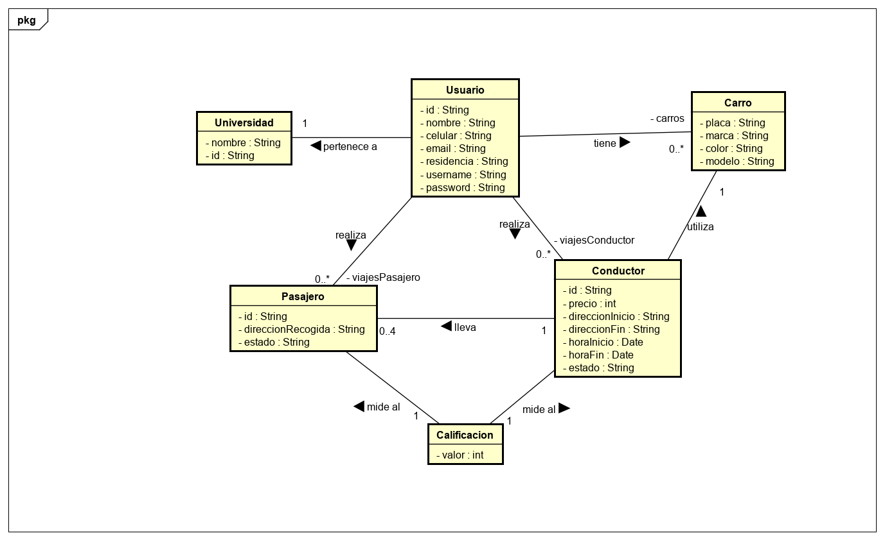

# UniWheelsBackend 

[](https://uniwheels-backend.herokuapp.com)
[](https://app.circleci.com/pipelines/github/Ron-404/UniWheelsBackend)

## Execute Project

```
git clone https://github.com/Ron-404/UniWheelsBackend.git
gradle spring-boot:run
```

## Class Model



## API's

### Authentication
1. /auth/addUser (Register)
```
{
    "username": "orlandoagk",
    "nombreCompleto":"Orlando Antonio Gelves Kerguelen",
    "direccionResidencia":"Calle 87",
    "password":"prueba",
    "email":"orlando@hotmail.com",
    "universidad":"ECI",
    "numero":"3267895438",
    "carros":[],
    "viajesConductor":[],
    "viajesPasajero":[]
}
```
2. /login (Login)
```
{
    "username":"orlandoagk",
    "password":"prueba"
}
```

### Uniwheels APIs

### External APIs
1. [Cars and model](https://the-vehicles-api.herokuapp.com/brands) -> This is used to feed the add car function information

* Brands of cars

```
     [{"id":36,"brand":"Acura"},
     {"id":29,"brand":"Alfa Romeo"},
     {"id":569,"brand":"Alkanes"},
     {"id":400,"brand":"Artic Cat"},
     {"id":565,"brand":"Aston Martin"}]
```
* Models of a Brand
```
[{"id":384,"model":"Serie 1",
     "brand":{"id":17,"brand":"BMW"},
     "type":{"id":1,"type":"Car"}},
     
     {"id":1548,"model":"GS",
     "brand":{"id":17,"brand":"BMW"},
     "type":{"id":2,"type":"Motor"}},
     
     {"id":1640,"model":"Serie 3",
     "brand":{"id":17,"brand":"BMW"},
     "type":{"id":1,"type":"Car"}},
     
     {"id":1649,"model":"Serie 5",
     "brand":{"id":17,"brand":"BMW"},
     "type":{"id":1,"type":"Car"}}]
 ```
