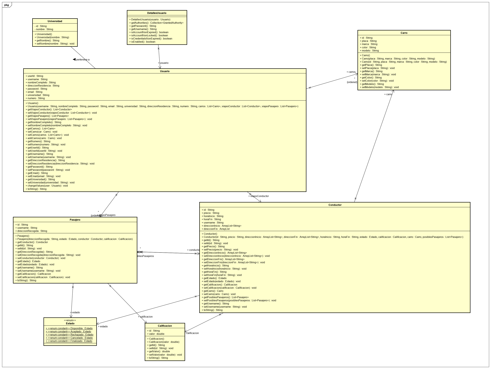

# UniWheelsBackend 
Para ingresar al link de despliegue en heroku dar click [aqui](https://uniwheelsbackend.herokuapp.com/)  

## Execute Project

1. `git clone https://github.com/Ron-404/UniWheelsBackend.git`
2. `gradle spring-boot:run`  

## Class Model

